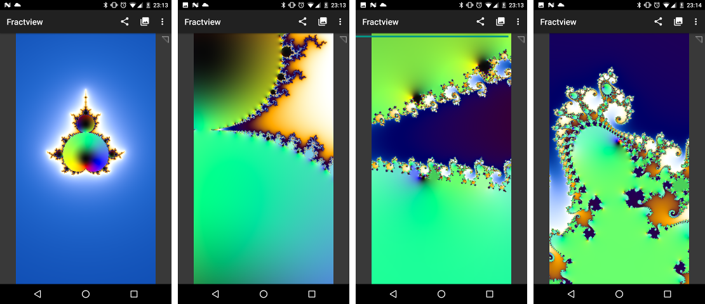
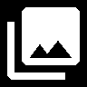
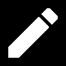
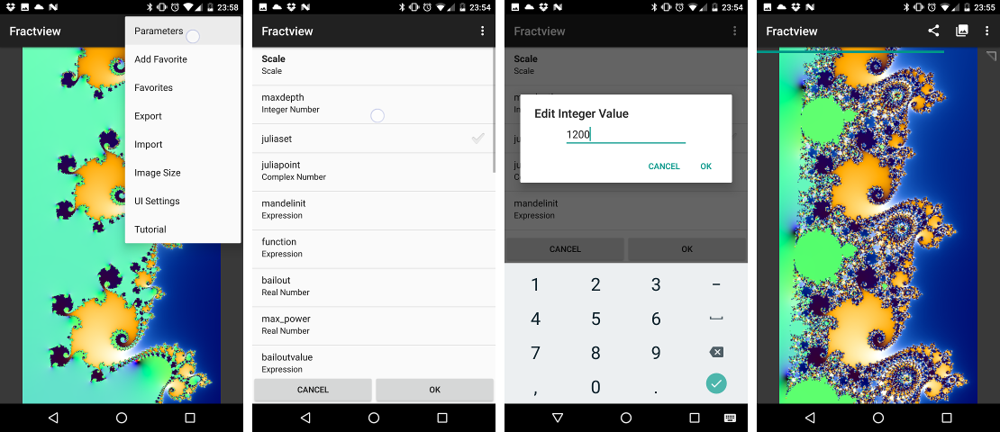
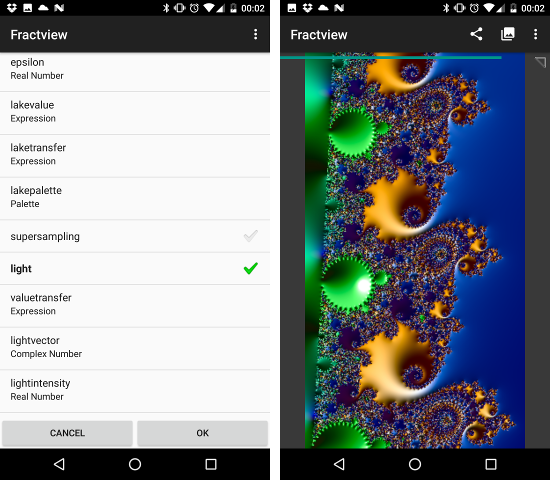

# Quick start

Fractview is a free, [open source](https://github.com/searles/FractviewAndroid) app for Android 5+ to render fractals. Fractals are images that you can enlarge as much as possible and still see a structure. You will encounter all kinds of nice shapes, spirals, dendrites, and also the original shape itself (a phenomenon called self-similarity) in these "mathematical monsters".

No app is perfect, please use the [feedback function in the play store]((https://play.google.com/store/apps/details?id=at.searles.fractview) to report bugs, for feature requests or to leave a review.

In the following, you find basic information on some features of Fractview. Further details can be found in the following parts of this tutorial:

* [User Interface and Menus](ui.html): More details on the user interface
* [Creating Custom Fractals](custom.html): Modify parameters to your liking
* [Function Reference](functionref.html): All functions implemented.

Please refer to [the blog](http://fractview.wordpress.com) for further topics about this app.

## First steps

After starting Fractview, a picture of the Mandelbrot Set is rendered. The progress of the rendering is indicated by a progress bar below the title bar (it is hidden after the rendering has finished). Using pinch-to-zoom and double-tap you can zoom into the fractal to discover further structures. 

The app supports portrait and landscape mode. The image is eventually rotated by 90 degrees to fill out as much space as possible while keeping the aspect ratio. If the image is rotated, a small triangle will appear to mark the top left corner of the image.

Fractview is very feature rich. In the following some aspects that are interesting for beginners are discussed. You find further links below.

## Presets/Demos

Fractview contains some demos/presets, accessible via . The demos-view consists of two screens. In the first screen you pick a program that will render the image. There are many different programs to draw basic fractals, newton fractals, lyapunov fractals, magnetic pendulum simulations or simply complex functions. You can select a program using a single tap. The first entry ("Current") will keep the current program.

The second view lets you select a parameter set: Each program contains some extern parameters that can be freely manipulated, for instance the current scale, the color palettes used to draw the fractal or even the function of the fractal. 

Most parameter sets can be used for more than one program, for instance a parameter set like "Phoenix Set" provides a fractal function that can be used in the Default program, the Fold program and others. If a program cannot interpret a parameter set (for instance if the parameter set requires values that do not exist in a program), you might encounter an error message though.

 

You can mix parameter sets with your current settings using a long tab and selecting "Merge".

## Parameters

You can manipulate these parameter sets directly by selecting "Parameters" in the menu or by tapping the icon . In this view you can edit all parameters and thereby enter custom formulas, change the color palettes or activate 3D effects. In the beginning, the most interesting paramter is most likely "maxdepth" because by increasing this number you can increase the amount of details at deeper zooms.

 

Notice that the parameters that were modified appear now in bold letters, meaning that these parameters contain custom values (as opposed to default values). Using a long tap, a menu appears in which you can revert all parameters to their default value (some arguments also contain further options).

If you merge the current fractal with a parameter set in the Preset view, these parameters will be used unless they are overruled by the new parameter set. 

Another interesting parameter is "light". You can toggle its state with a single tap. If it is checked, you obtain a nice 3D effect.

 

Fractview allows you to create custom (two dimensional) color palettes using an intuitive palette editor and color picker. The *bailoutpalette* contains the colors used of the outside of the fractal (in the Default program it uses only one dimension), the *lakepalette* is used for the inside (this one uses two dimensions).

You find more information on parameters in this article: [Creating Custom Fractals](custom.html).

## Favorites

Fractview allows you to store the current program and parameter set. From the main view, you can add your favorites using "Add to Favorites". You can also directly add a favorite when you save the image. 

To access your favorites and to share your collection, pick "Favorites" from menu. It will open a new view in which you can pick a favorite using a single tap.
 
You can select multiple entries using a long tap. This way you can delete the selected entries or rename a favorite. 

Furthermore it is possible to export the selected favorites. This creates a text file (the format used is called "json") that you can share with others. If you download such a text file, you can import it via the import menu. 
 

## Other menus

There are further menus to save/share a fractal, accessible via share. In this menu you can select to share the current picture, save it to the gallery or to use it as your wallpaper. If the rendering is not yet finished, saving will be stalled. 

You can also copy a fractal into the clipboard and paste it somewhere else (this way I share fractals with my daughter via Google Hangouts).

Finally, there is a menu "UI Settings" that lets you display a grid, activate rotation lock or deactivate the zoom controls.

## For technically interested users

Fractview uses a framework called Renderscript to generate images. A compiler creates some bytecode out of the program and its parameters that are executed in a virtual machine in Renderscript. It is possible to write your own programs in the backing programming language Meelan (that is heavily inspired from Python and C). Careful because similar to OpenGL, Meelan does not support recursion.

Color palettes use the [Lab color space](https://en.wikipedia.org/wiki/Lab_color_space) and two dimensional hermite spline interpolation of the color components. When creating the first version I spent some time to compare various color spaces and nothing beats Lab in my opinion. Fractview is currently the only app known to me that actually supports two dimensional color palettes.

Thanks for your interest in my little app. 

-- Karl
